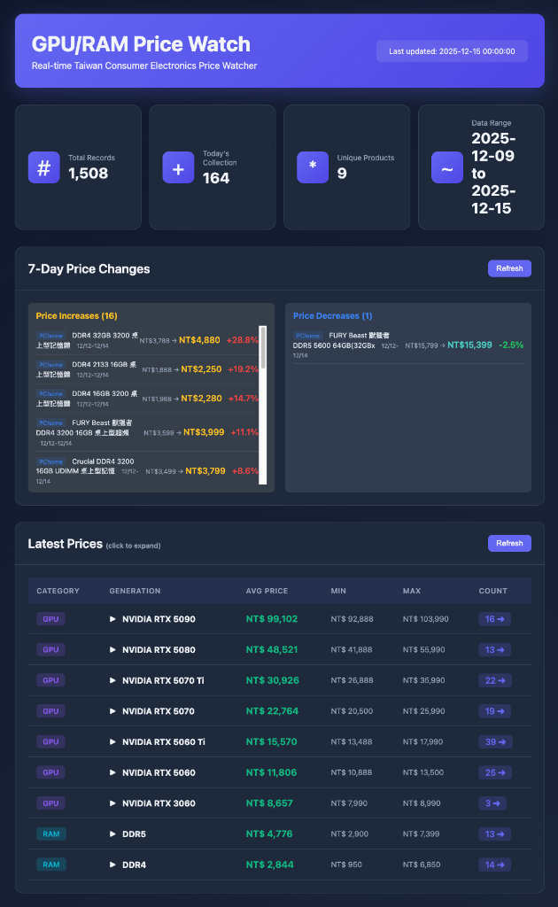
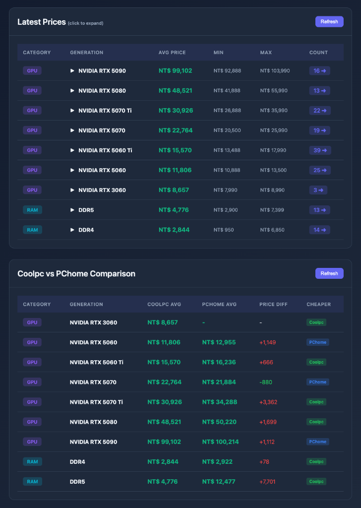
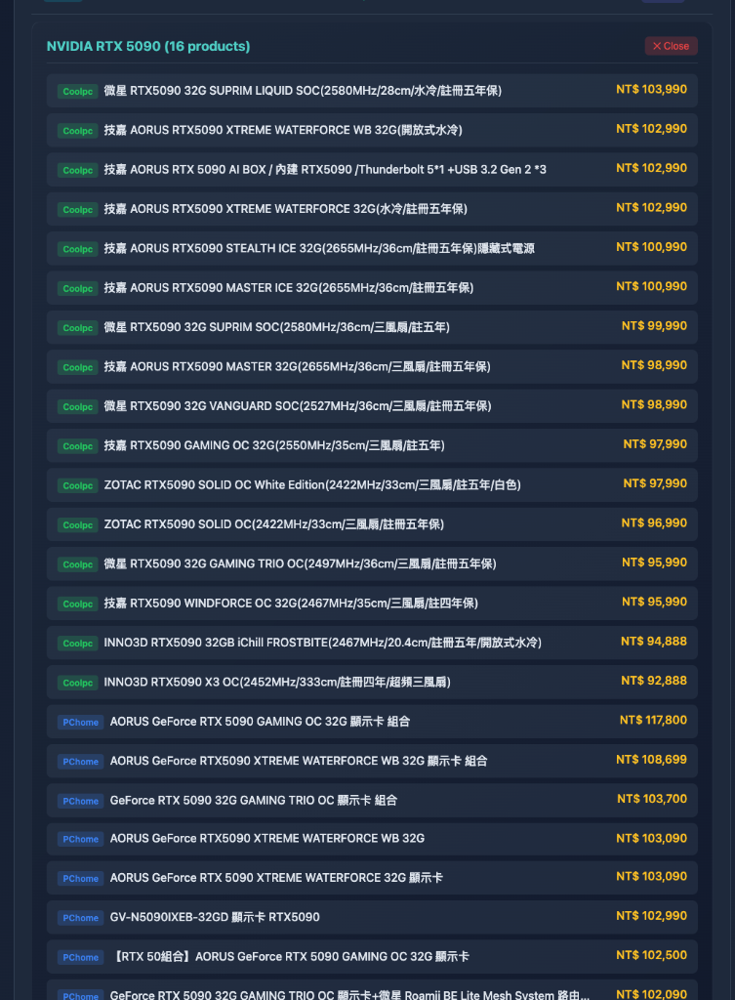
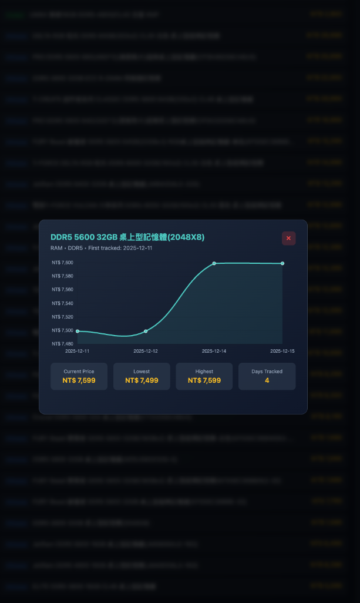
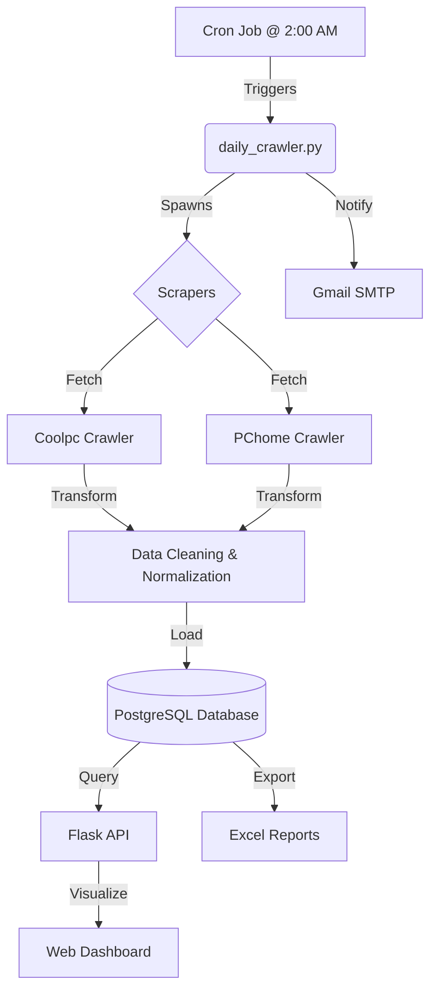

# GPU and RAM Price Index

An automated data collection system for tracking consumer electronics prices in Taiwan's market, designed for alternative data analysis in quantitative finance.

## Overview

This project collects daily pricing data for GPUs and RAM from Taiwan's consumer electronics market over a 30-day period. The goal is to explore potential correlations between consumer electronics prices and semiconductor stock performance (TSMC, NVIDIA).

## Dashboard Preview

### 1. Market Overview & Weekly Trends
*Real-time statistics and 7-day price volatility analysis*  


### 2. Cross-Platform Comparison (Coolpc vs PChome)
*Live price comparison between major retailers to identify arbitrage/cheapest sources*  


### 3. Detailed Price Tracking
*Component-level price history and trend visualization*  



## Subscribe for Daily Updates

Want to receive the daily price summary in your inbox?
**[Click here to subscribe via Google Form](https://forms.gle/8XUzQaDyYzcyuNj99)**

*You can subscribe to get daily price drops, new product alerts, and market trend summaries.*

## Features

- **Multi-Source Data Collection**: Automated daily crawlers for **Coolpc (原價屋)** and **PChome 24h**, fetching prices for GPUs and RAM.
- **Data Engineering Pipeline**: Robust ETL process using Python, PostgreSQL, and Pandas.
- **Price Trend One-click Report**: Generates daily Excel reports containing price history, volatility analysis, and cross-platform comparisons.
- **Real-time Dashboard**: Interactive Flask-based web UI displaying 7-day price fluctuations (increases/decreases) and new product alerts.
- **DevOps automation**:
  - **Cron Jobs**: Scheduled execution.
  - **Power Management**: Uses `pmset` to automatically wake the host machine (Mac Mini) for crawling and sleep afterwards to save energy.
  - **LaunchAgents**: Background service management for the dashboard.

## Architecture



## Technology Stack

- **Language**: Python 3.9+
- **Data Engineering**: Pandas, SQLAlchemy, PostgreSQL
- **Web Scraping**: BeautifulSoup4, Requests (w/ Headers rotation)
- **Web Framework**: Flask, HTML5/CSS3 (Grid Layout), JavaScript
- **Automation**: Cron, macOS Power Management (`pmset`), Launchd
- **Reporting**: OpenPyXL (Excel automation)

## Installation

### Prerequisites

- Python 3.9 or higher
- PostgreSQL 12 or higher
- macOS (recommended for complete power scheduling features)

### Setup

1. Clone the repository:
```bash
git clone https://github.com/travs351001nccu/gpu-ram-price-index.git
cd gpu-ram-price-index
```

2. Install dependencies:
```bash
pip install -r requirements.txt
```

3. Configure database:
```bash
# Create PostgreSQL database
createdb price_index

# Set environment variables
export PGUSER=your_username
export PGPASSWORD=your_password
```

4. Configure email notifications (optional):
```bash
export GMAIL_ADDRESS=your_email@gmail.com
export GMAIL_APP_PASSWORD=your_app_password
export NOTIFICATION_EMAIL=recipient@gmail.com
```

## Usage

### Manual Execution

Run the crawler manually:
```bash
python3 daily_crawler.py
```

Query collected data:
```bash
python3 query_data.py
```

### Automated Execution

Install cron job for daily execution:
```bash
crontab cron_setup.txt
```

Configure power schedule (macOS):
```bash
sudo pmset repeat wake MTWRFSU 01:55:00
sudo pmset repeat sleep MTWRFSU 03:00:00
```

### Web Dashboard

Start the dashboard:
```bash
python3 dashboard.py
```

Access at: http://localhost:5001

## Data Collection

### Target Products

- **GPUs**: NVIDIA RTX 3060, 5060, 5060 Ti, 5070, 5070 Ti, 5080, 5090
- **RAM**: DDR4, DDR5 modules

### Data Points

- Product name and category
- Daily prices (average, min, max, median)
- Product availability count
- Price volatility metrics
- Timestamp and source information

### Database Schema

**products**: Product catalog with metadata
**daily_prices**: Individual price records
**daily_index**: Aggregated daily statistics

## Analysis Goals

1. Track price trends over 30-day period
2. Identify price volatility patterns
3. Correlate with semiconductor stock prices (TSMC, NVIDIA)
4. Explore alternative data signals for quantitative trading

## Project Timeline

- **Duration**: 30 days (December 9, 2025 - January 8, 2026)
- **Target Records**: 6,000+ price points
- **Collection Frequency**: Daily at 2:00 AM Taiwan time

## Results (After Completion)

Results and analysis will be added after the 30-day collection period:
- Price trend visualizations
- Statistical analysis
- Correlation studies with stock prices
- Key findings and insights

## Contributing

This is a research project for academic purposes. Contributions and suggestions are welcome.

## License

MIT License - see LICENSE file for details

## Author

Travis Cua
- GitHub: [@travs351001nccu](https://github.com/travs351001nccu)
- Project: Alternative Data Collection for Quantitative Finance

## Acknowledgments

- Data source: Coolpc Taiwan
- Built as part of quantitative finance research
- Demonstrates automated data pipeline development

## Disclaimer

This project is for educational and research purposes only. Price data is collected from publicly available sources. Not intended for commercial use.
